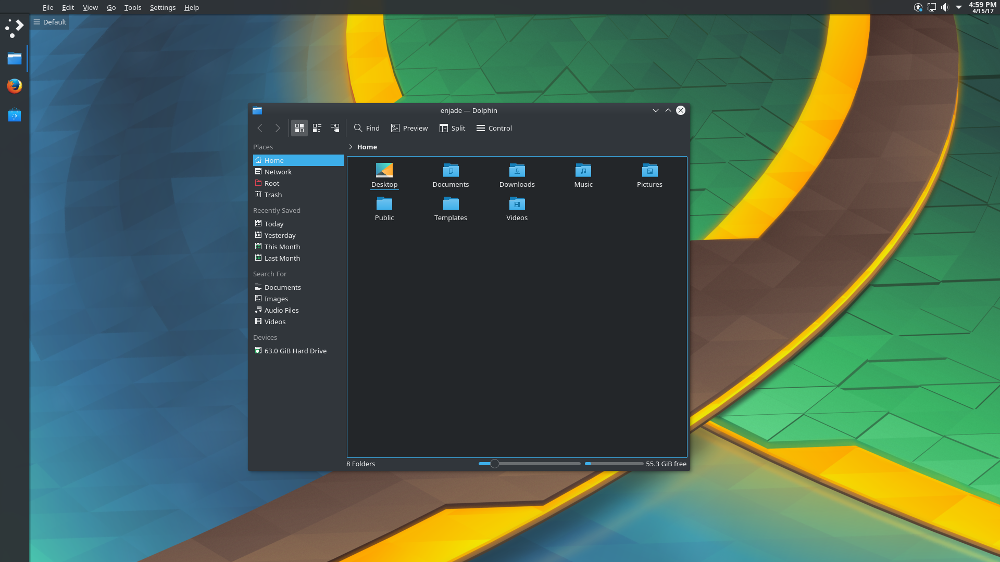

###### KDE Desktop that shows the concept of the Enjade desktop
## The desktop of Unity, with the framework of Plasma
The Enjade desktop environment is a community project to recreate and continue the Unity desktop environment. From the versatile Dash down to the global menu, Enjade promises to provide the familiar experience Ubuntu users love while adding new features to keep it up with the latest trends.

## (Planned) Features:
* Entire desktop created from Plasma
* Compatibility with the Wayland display server
* Distribution through a Snappy/Flatpak package
* Versatile search functionality, including:
    * Calculations
    * Google searches
    * Dictionary
    * Files and apps

## Made for the community
Enjade is made for the community by the community. Check our [GitHub repository](https://www.github.com/enjade-project/) and see how you can contribute today!

## Contact
The Enjade project is currently led by Marquis Kurt, contactable through [Telegram](http://t.me/ubunturox104) or [email](mailto:ubunturox104@gmail.com). New Telegram groups and IRC channels to come soon! 